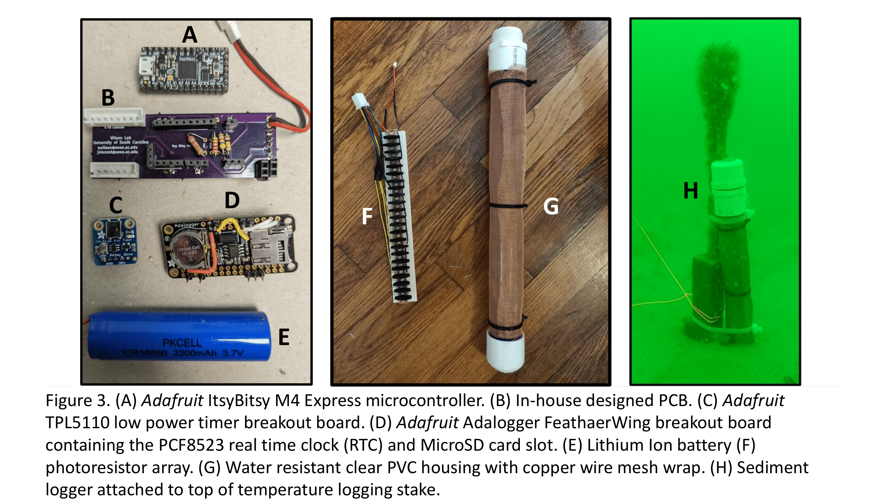
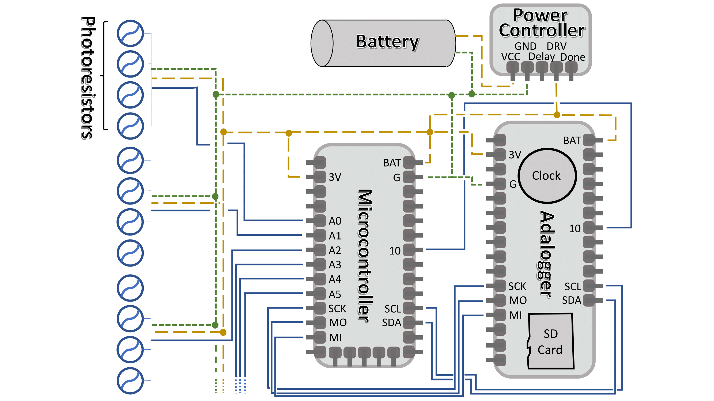
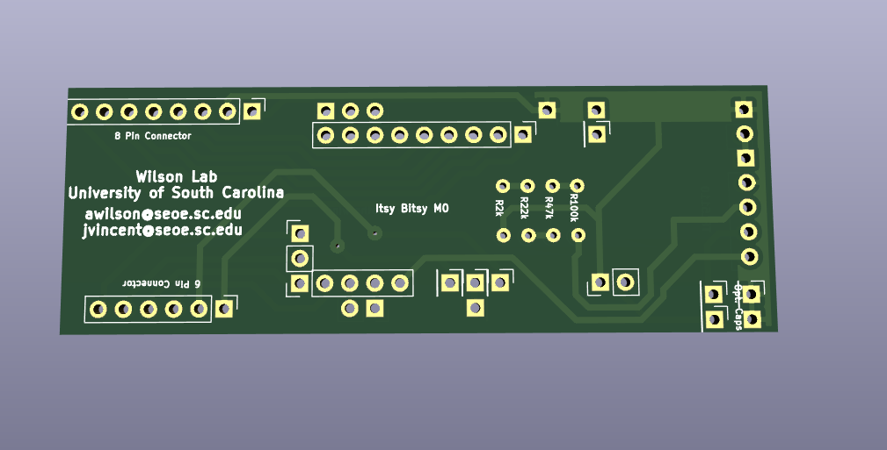
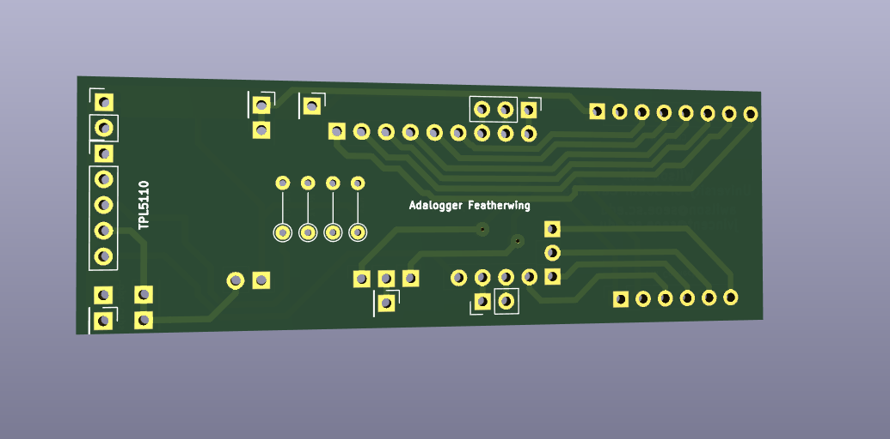

# Sediment_level_logger
Open-source sediment level loggers to record sediment level time-series data with accuracy up to 1 cm.

# Overview
Knowledge of sediment erosion and deposition can be useful for a variety of engineering, marine science, and environmental applications, but collecting detailed sediment level time-series measurements can be challenging, particularly in coastal marine environments. We developed economical and open-source sediment level loggers to record sediment level time-series data with accuracy up to 1 cm. The logger is composed of a programmable Circuit-Python (or Arduino) microcontroller and “breakout boards” that attach to a specially designed printed circuit board (PCB) and an array of evenly spaced photoresistors enclosed in a robust waterproof housing.

The sediment level loggers described below, use light sensors to detect changes in the elevation of the seafloor. They are designed to be built on a low budget and provide substantial amounts of data over a long period of time with no user input after deployment. 
Desirable characteristics for this monitoring platform include:  
*	Assembled from a small number of low-cost, readily available components
*	Supports a wide variety of analog and digital sensors
*	Non-proprietary software and file formats
*	Removable microSD storage media
*	User-adjustable operating parameters, such as sampling interval
*	Operating life span > 1 year using reusable lithium or alkaline AAA batteries 
*	Rugged, chemically resistant environmental housing for submerged or buried deployments

#  Documentation 

Full documentation will be found in an upcomming journal article and will be posted in this place when published. 

# Software

The Circuit python files and library used can be found in the "CircuitPython" folder above. 

# Diagram of Components

# Board layout 

Gerber files to create or order your own PCB can be found in the "PCB_v2" folder above.

## License Information

| **Type** | **License** |
| --- | --- |
| Hardware | Copyright Jacob Vincent 2022. This source describes Open Hardware and is licensed under the CERNOHL-S v2. You may redistribute and modify this source and make products using it under the terms of the CERN-OHL-S v2 (https://ohwr.org/cern ohl s v2.txt ). This source is distributed WITHOUT ANY EXPRESS OR IMPLIED WARRANTY, INCLUDING OF MERCHANTABILITY, SATISFACTORY QUALITY AND FITNESS FOR A PARTICULAR PURPOSE. Please see the CERN-OHL-S v2 for applicable conditions. Source location: https://example_url As per CERN-OHL-S v2 section 4, should You produce hardware based on this source, You must where practicable maintain the Source Location visible on the external case of the Gizmo or other products you make using this source.|
| Software | [MIT License](tree/master/LICENSE.txt) |
| Documentation |  This work is licensed under a <a rel="license" href="http://creativecommons.org/licenses/by-sa/4.0/">Creative Commons Attribution-ShareAlike 4.0 International License</a>. |

